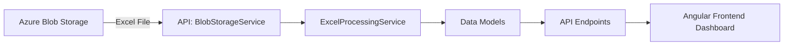

# 🏭 Inventory Management API

This repository contains the **.NET Core API** for the [Inventory Management Dashboard](https://github.com/shabbir-bharmal/inventory-management) Angular application.

The API is responsible for:
- Fetching Excel files from **Azure Blob Storage**
- Processing and transforming the data
- Serving endpoints to render the **interactive dashboard** in the front-end application

---

## 📁 Project Overview

**Frontend:** [Inventory Management (Angular App)](https://github.com/shabbir-bharmal/inventory-management)  
**Backend:** ASP.NET Core Web API  
**Storage:** Azure Blob Storage  
**Data Type:** Excel files (inventory and stock data)

### 🔄 Workflow Summary
1. The API fetches the Excel sheet from **Azure Blob Storage**.
2. Parses and processes the Excel data into structured format.
3. Exposes REST endpoints for the Angular frontend.
4. The frontend consumes these endpoints to display:
   - Stock levels
   - Warehouse inventory
   - Low stock alerts
   - Reorder level analytics

---

## ⚙️ Technologies Used

| Component | Technology |
|------------|-------------|
| **Backend Framework** | ASP.NET Core 7.0 / 8.0 |
| **Data Source** | Excel files stored in Azure Blob Storage |
| **Cloud Provider** | Microsoft Azure |
| **Storage SDK** | Azure.Storage.Blobs |
| **Data Parsing** | EPPlus / ClosedXML |
| **Logging** | Serilog / Microsoft.Extensions.Logging |
| **Authentication (optional)** | JWT / IdentityServer (if implemented) |

---

## 🧱 Project Structure

```
inventory-management-api/
│
├── Controllers/
│   ├── InventoryController.cs
│   ├── DashboardController.cs
│
├── Services/
│   ├── BlobStorageService.cs
│   ├── ExcelProcessingService.cs
│
├── Models/
│   ├── InventoryItem.cs
│   ├── Warehouse.cs
│   ├── Product.cs
│
├── appsettings.json
├── Program.cs
```

---

## 🚀 Getting Started

### Prerequisites

- [.NET SDK 7.0+](https://dotnet.microsoft.com/en-us/download)
- [Azure Storage Account](https://portal.azure.com/)
- [Azure Blob Container](https://learn.microsoft.com/en-us/azure/storage/blobs/)
- Valid **Connection String** for Azure Blob

### Clone the Repository

```bash
git clone https://github.com/shabbir-bharmal/inventory-management-api.git
cd inventory-management-api
```

### Configure Azure Blob Connection

Update `appsettings.json` with your Azure details:

```json
{
  "AzureStorage": {
    "ConnectionString": "<your-azure-blob-connection-string>",
    "ContainerName": "<your-container-name>",
    "ExcelFileName": "inventory_data.xlsx"
  }
}
```

---

## ▶️ Running the API

```bash
dotnet build
dotnet run
```

The API will start at:

```
https://localhost:5001
http://localhost:5000
```

---

## 🌐 Example Endpoints

| Method | Endpoint | Description |
|--------|-----------|-------------|
| `GET` | `/api/inventory` | Fetch processed inventory data |
| `GET` | `/api/inventory/low-stock` | Get low stock alerts |
| `GET` | `/api/dashboard` | Get summarized analytics for dashboard |
| `POST` | `/api/inventory/upload` | Upload new Excel file to Azure Blob (optional) |

---

## 🧮 Data Flow Overview



---

## 🧰 Useful Commands

| Command | Description |
|----------|-------------|
| `dotnet restore` | Restore dependencies |
| `dotnet build` | Build the project |
| `dotnet run` | Run the API locally |
| `dotnet publish -c Release` | Publish the app for production |

---

## 🧩 Integration with Angular App

1. Run the API locally or deploy to Azure App Service.
2. Update the Angular app’s environment file:

```typescript
// environment.ts
export const environment = {
  production: false,
  apiBaseUrl: 'https://localhost:5001/api'
};
```

3. Start the Angular app, and it will automatically fetch and display data from the API.

---

## ☁️ Deployment (Azure)

To deploy on Azure:
- Use **Azure App Service** for hosting API
- Use **Azure Blob Storage** for Excel data
- Set environment variables for connection strings in Azure configuration

---

## 📸 Dashboard Preview

You can include images like this in your README:

```markdown

```

---

## 🧑‍💻 Author

**Shabbir Bharmal**  
[GitHub Profile](https://github.com/shabbir-bharmal)

---

## ⭐ Acknowledgements

- [Azure Blob Storage SDK](https://learn.microsoft.com/en-us/dotnet/api/overview/azure/storage.blobs-readme)
- [ClosedXML](https://github.com/ClosedXML/ClosedXML)
- [EPPlus](https://github.com/EPPlusSoftware/EPPlus)
- [ASP.NET Core](https://learn.microsoft.com/en-us/aspnet/core/)

---
